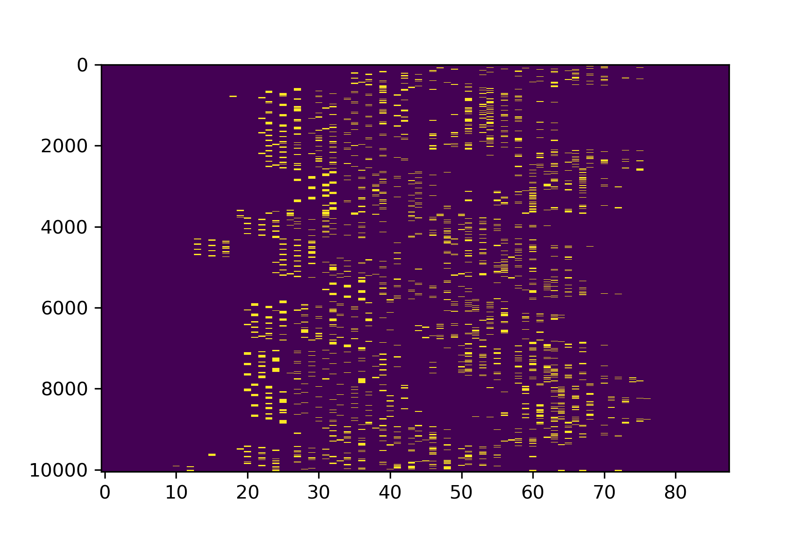
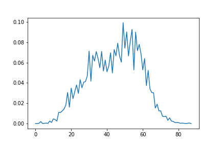
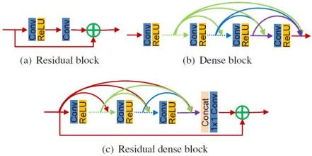

# Deep-Piano
Play The Piano With Deep Learning
### prepare your dataset
- collect some midi files and put them in the midi folder
- run prepare.py, we will count the frequency at which notes are pressed

  
  

### creat the model
- the model uses deep one-dimensional residual dense convolution network to extract time series characteristics

  

### train the model
- run train.py

### generate piano melody
- run predict.py
